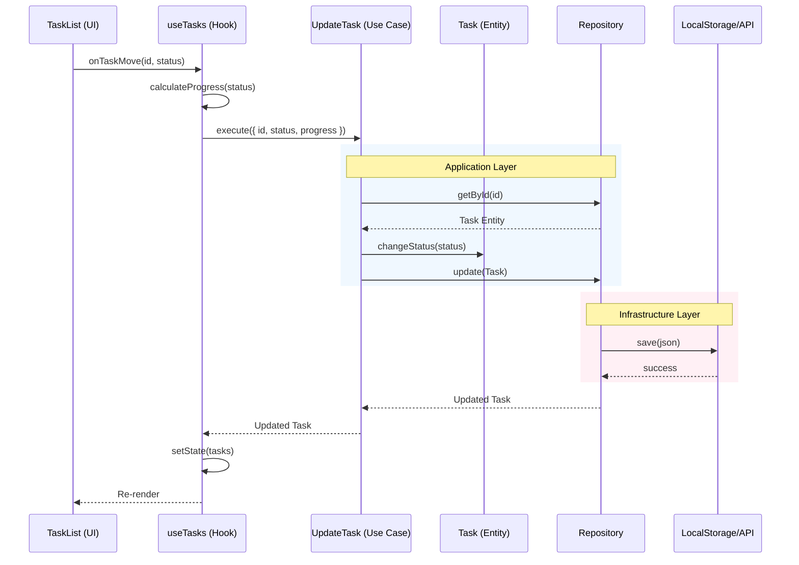

# System Architecture & Data Flow

This document explains the Clean Architecture implementation of the Task Completion Tracking application.

## 1. Complete Data Flow

Here is the lifecycle of a user action (e.g., **Moving a Task**):



### Step-by-Step Breakdown

1.  **Presentation (View)**: The User drags a card in `TaskList`. The component calls `moveTask(id, 'done')` from props.
2.  **Presentation (Controller/Hook)**: `useTasks` hook receives the call.
    *   It determines the new progress % using the `CalculateProgress` use case.
    *   It delegates the actual update to the `UpdateTask` use case.
3.  **Application (Use Case)**: `UpdateTask` receives the input DTO.
    *   It asks the `TaskRepository` for the task entity.
    *   It calls domain methods like `task.changeStatus()`.
    *   It asks the `TaskRepository` to save the modified entity.
4.  **Domain (Entity)**: The `Task` entity ensures rules are followed (validations) but knows nothing about storage or UI.
5.  **Infrastructure (Repository)**: `LocalStorageTaskRepository` takes the Domain Entity.
    *   Converts it to JSON.
    *   Saves it to the browser's `localStorage`.
6.  **State Update**: The hook receives the success result and updates the React state, causing the UI to re-render with the new data.

---

## 2. Backend Integration Strategy

One of the main goals of this architecture is **Backend Readiness**.

### Current Setup
Currently, `TaskDependenciesContext` initializes a **Local Storage** repository:

```typescript
// src/app/context/TaskDependenciesContext.tsx
const taskRepository = new LocalStorageTaskRepository();
```

### How to Plug in a Real Backend

When you are ready to add a Node.js, Python, or Go backend:

1.  **Create a New Repository**:
    Create `src/infrastructure/repositories/ApiTaskRepository.ts` that implements `TaskRepository`.

    ```typescript
    export class ApiTaskRepository implements TaskRepository {
        async getAll() {
            const resp = await fetch('/api/tasks');
            return resp.json().map(mapToEntity);
        }
        // ... implement other methods
    }
    ```

2.  **Swap in Context**:
    Update the Composition Root in `TaskDependenciesContext.tsx`:

    ```diff
    - const taskRepository = new LocalStorageTaskRepository();
    + const taskRepository = new ApiTaskRepository(baseUrl);
    ```

**Result**:
- **0%** of your UI components need to change.
- **0%** of your Domain Logic (Entities/UseCases) needs to change.
- The app instantly switches to using the live backend.
